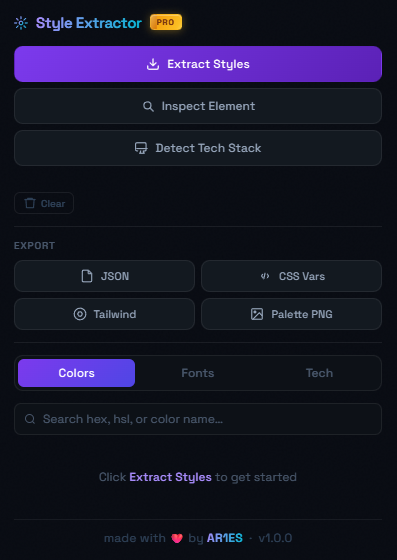

# Style Extractor PRO
A powerful Chrome extension to **extract colors, fonts, and tech stack** from any website — instantly.




---

## Features

### Color Extraction
- Extract up to **80 unique colors** from any page  
- Smart **deduplication** (removes similar shades)  
- Auto-grouped by color (Red, Blue, Gray, etc.)  
- Copy as:
  - HEX  
  - HSL  
- Export as:
  - JSON  
  - CSS variables  
  - Tailwind config  
  - PNG palette  

---

### Font Detection
- Detect all fonts used on a page  
- Shows:
  - Font family  
  - Weights  
  - Sizes  
  - Web vs system fonts  
- One-click copy:
  - Font name  
  - CSS declaration  
- Quick link to Google Fonts  

---

### Tech Stack Detection
- Detect frameworks, libraries & platforms:
  - React, Next.js, Vue, Angular  
  - Shopify, WordPress, Webflow  
  - Tailwind, Bootstrap  
  - Analytics tools, CDNs, and more  
- Categorised view for clarity  

---

### Live Inspect Mode
- Click any element on a page  
- Instantly view:
  - Font styles  
  - Colors  
  - Spacing (padding/margin)  
  - Border radius  
- Click any value to **copy it**  
- Press `ESC` to exit  

---

### Export Options
- `styles.json` → full data dump  
- `variables.css` → ready-to-use CSS variables  
- `tailwind.config.js` → plug into Tailwind  
- `palette.png` → clean visual palette  

---

### Smart Features
- Per-domain **caching** (fast reloads)  
- Manual cache clearing  
- Rate-limited extraction (prevents spam)  
- Clean, minimal UI with dark theme  

---

## 🚀 Installation

### 1. Clone the repo
```bash
git clone https://github.com/AR1ES-DEV/style-extractor-pro.git
cd style-extractor-pro
```

### 2. Load into Chrome
1. Open `chrome://extensions/`
2. Enable **Developer Mode**
3. Click **Load unpacked**
4. Select the project folder

---

## Tech Stack

- Vanilla JavaScript (no frameworks)
- Chrome Extensions API (Manifest v3)
- Canvas API (PNG export)
- DOM + CSSOM parsing

---

## Project Structure

```
/src
  ├── popup.js        # Main logic (UI + extraction + export)
  ├── popup.html
  ├── popup.css
  ├── content scripts
  └── manifest.json
```

---

## How It Works

### Color Extraction
- Scans all DOM elements  
- Collects computed styles (`color`, `background`, etc.)  
- Converts RGB → HEX  
- Deduplicates similar colors using distance threshold  

### Font Detection
- Reads computed `font-family`  
- Tracks sizes + weights  
- Cross-checks with:
  - `document.fonts`
  - Known system fonts  

### Tech Detection
- Pattern matching against:
  - Script URLs  
  - HTML content  
  - Global variables  
- Uses a rule-based detection system  

---

## Roadmap

- [ ] Figma export  
- [ ] Gradient detection  
- [ ] Screenshot → palette  
- [ ] Design system auto-generation  
- [ ] Save/export presets  

---

## 🤝 Contributing

Pull requests are welcome.

If you want to improve:
- Detection accuracy  
- UI/UX  
- Performance  

Open an issue first or submit a PR.

---

## 📄 License

MIT License

---

## ❤️ Credits

Made with ❤️ by **AR1ES**
